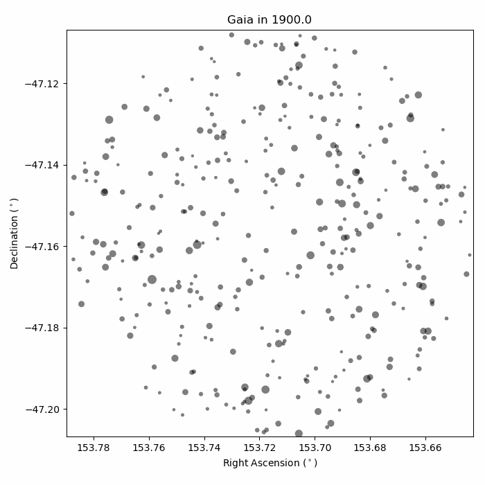

# the-friendly-stars
`the-friendly-stars` is a Python toolkit for interacting with catalogs of stars and images of the sky. It can be used to make custom finder charts, as well as do a tiny bit of cross-matching across catalogs.

Following [The Friendly Stars](https://play.google.com/books/reader?id=xa8RAAAAYAAJ&printsec=frontcover&output=reader&hl=en&pg=GBS.PP1) by Martha Evans Martin (1925), "the chief aim of this [package] is to share with others the pleasure which the writer has had in what may be called a relation of personal friendship with the stars." It is still a *work in progress*.

## Usage

Please feel free to peruse the few examples of how `thefriendlystars` works in `notebooks/`, as well as the tests in the `tests/`. One simple usage would be to run
```
from thefriendlystars.constellations import Gaia
g = Gaia.from_cone('GJ1132')
g.animate('GJ1132-weeeeeeee.gif')
```
to make a finder chart that would work for past, present, and future astronomers.



## Installation
You should be able to install this simply by running `pip install git+https://github.com/zkbt/the-friendly-stars.git`.

If you want to be able to modify the code yourself, please also feel free to fork/clone this repository onto your own computer and install directly from that editable package. For example, this might look like:
```
git clone https://github.com/zkbt/the-friendly-stars.git
cd craftroom/
pip install -e .
```
This will link the installed version of the `thefriendlystars` package to your local repository. Changes you make to the code in the repository should be reflected in the version Python sees when it tries to `import thefriendlystars`.

## Contributors

This package was written mostly by [Zach Berta-Thompson](https://github.com/zkbt), with contributions from [Luci Ibarra Perez](https://github.com/luib0557).
